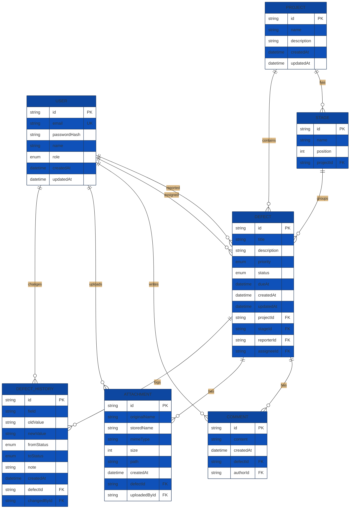

# СистемаКонтроля: управление дефектами на стройобъектах

## Описание
Монолитное веб-приложение для централизованного учёта дефектов: регистрация, назначение исполнителей, контроль статусов, аналитика и отчётность.

## Запуск
```bash
npm install
npm run prisma:migrate
npm run seed
npm run dev
```
Приложение доступно на `http://localhost:3000`.

### Тестовые пользователи
- `admin@local.com` / `admin123` (менеджер)
- `eng@local.com` / `eng12345` (инженер)

## Скрипты npm
- `npm run dev` — запуск в режиме разработки
- `npm run build` / `npm start` — сборка и запуск прод-версии
- `npm run seed` — заполнение демо-данных
- `npm run test` — Vitest (≥5 unit, ≥2 integration)
- `npm run bench` — нагрузочный тест (autocannon)

## Документация
- `docs/testing-plan.md` — план тестирования
- `docs/DEPLOY.md` — инструкция по деплою
- `docs/er-diagram.mmd` — ER-диаграмма (Mermaid)

### ER-диаграмма


## Технологии
- Node.js, Express 5, TypeScript
- Prisma + SQLite
- EJS + EJS-mate (шаблоны)
- Chart.js для аналитики
- Helmet, CSRF, bcrypt, multer
- Vitest + Supertest (тесты)

## Структура ключевых модулей
- `src/app.ts` — инициализация сервера
- `src/ui/*` — маршруты (auth, projects, defects, reports)
- `src/views/*` — EJS-шаблоны интерфейса
- `prisma/schema.prisma` — описание БД
- `prisma/seed.ts` — сидинг демо-данных
- `tests/*` — unit и integration тесты

